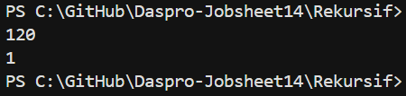
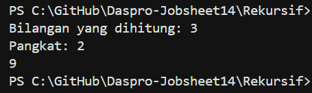
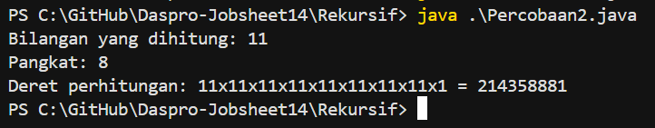
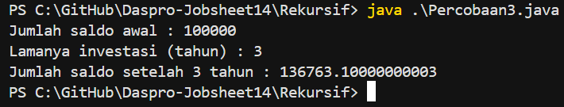
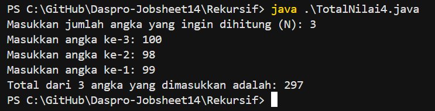

# JOBSHEET 14

# PERCOBAAN 

## - Percobaan 1

## - Percobaan 1 : Verifikasi Hasil Percobaan 



_Pertanyaan:_

1.  Apa yang dimaksud dengan fungsi rekursif?
2.  Pada Percobaan1, apakah hasil yang diberikan fungsi faktorialRekursif() dan fungsi faktorialIteratif() sama? Jelaskan perbedaan alur jalannya program pada penggunaan fungsi rekursif dan fungsi iteratif!

_Jawaban:_

1.  Fungsi rekursif adalah fungsi (method) yang memanggil dirinya sendiri untuk menyelesaikan suatu masalah, biasanya dengan memecah masalah besar menjadi versi yang lebih kecil dari masalah yang sama
    - Ciri utama fungsi rekursif 
        a. Memanggil dirinya sendiri 
        b. Memiliki kondisi berhenti (base case) agar tidak berjalan tanpa henti
        c. Setiap pemanggilan membawa masalah yang lebih kecil
2.  Hasil kedua fungsi tidak sama. Fungsi rekursif berhasil menghitung faktorial dengan pemanggilan berulang. Fungsi iteratif gagal menghitung karena kesalahan kodisi perulangan. Perbedaan utama terletak pada alur eksekusi : rekursif meggunakan pemanggilan diri sendiri, sedangkan iteratif menggunakan loop.

## - Percobaan 2 

## - Percobaan 2 : Verifikasi Hasil Percobaan 



_Pertanyaan:_

1.  Pada Percobaan2, terdapat pemanggilan fungsi rekursif hitungPangkat(bilangan, pangkat) pada fungsi main, kemudian dilakukan pemanggilan fungsi hitungPangkat() secara berulangkali. Jelaskan sampai kapan proses pemanggilan fungsi tersebut akan dijalankan!
2.  Tambahkan kode program untuk mencetak deret perhitungan pangkatnya. Contoh: hitungPangkat(2,5) dicetak 2x2x2x2x2x1 = 32

_Jawaban:_ 

1.  Proses pemanggilan fungsi rekursif hitungPangkat() akan terus berjalan sampai nilai pangkat (y) bernilai 0. Kondisi y == 0 berfungsi sebagai kondisi berhenti (base case) yang mencegah rekursi berjalan tanpa batas.

2.  
    ```java
        package Rekursif;

        import java.util.Scanner;

        public class Percobaan2 {
            static int hitungPangkat(int x, int y) {
                if (y == 0) { 
                    System.out.print("1");
                    return 1;
                } else {
                    System.out.print(x + "x");
                    return (x * hitungPangkat(x, y - 1));
                }
            }

            public static void main(String[] args) {
                Scanner sc = new Scanner(System.in);

                int bilangan;
                int pangkat;

                System.out.print("Bilangan yang dihitung: ");
                bilangan = sc.nextInt();
                System.out.print("Pangkat: ");
                pangkat = sc.nextInt();

                System.out.print("Deret perhitungan: ");
                int hasil = hitungPangkat(bilangan, pangkat);
                System.out.println(" = " + hasil);
            }
        }
    ```
    Output : 

    

## - Percobaan 3

## - Percobaan 3 : Verifikasi Hasil Percobaan 



_Pertanyaan:_

1.  Pada Percobaan3, sebutkan blok kode program manakah yang merupakan "base case" dan "recursion call"!
2.  Jabarkan trace fase ekspansi dan fase subtitusi algoritma perhitungan laba di atas jika diberikan nilai hitungLaba(100000, 3)

_Jawaban:_

1.  - Base case -> if (tahun == 0) return saldo;
    - Recursion call -> hitungLaba(saldo, tahun - 1)
2.  - Fase Ekspansi (Expansion Phase) : Fase ekspansi adalah fase pemanggilan fungsi secara berulang sampai mencapai base case.
    -> Fase Ekspansi
    hitungLaba(100000, 3)
        = 1.11 * hitungLaba(100000, 2)

        = 1.11 * (1.11 * hitungLaba(100000, 1))

        = 1.11 * (1.11 * (1.11 * hitungLaba(100000, 0)))

        = 1.11 * 1.11 * 1.11 * hitungLaba(100000, 0)

    - Fase Substitusi (Substitution Phase) : Fase substisui adalah fase pengembalian nilai dari base case ke pemanggilan sebelumnya. 
    -> Fase Substitusi
    = 1.11 * 1.11 * 1.11 * 100000
    = 1.367631 * 100000
    = 136763.1

# TUGAS

1.  Code : 
    ```java 
        package Rekursif;

        import java.util.Scanner;

        public class TotalNilai4 {
            // Fungsi Rekursif
            static int totalRekursif(Scanner sc, int n) {
                if (n == 0) {
                    return 0; // base case
                } else {
                    System.out.print("Masukkan angka ke-" + n + ": ");
                    int angka = sc.nextInt();
                    return angka + totalRekursif(sc, n - 1);
                }
            }

            // Fungsi Iteratif 
            static int totalIteratif(Scanner sc, int n){
                int total = 0;
                for (int i = 0; i >= 1 ; i--) {
                    System.out.print("Masukkan angka ke-" + i + ": ");
                    total += sc.nextInt();
                }
                return total;
            }

            public static void main(String[] args) {
                Scanner sc = new Scanner(System.in);

                int N;
                System.out.print("Masukkan jumlah angka yang ingin dihitung (N): ");
                N = sc.nextInt();

                int total = totalRekursif(sc, N);

                System.out.println("Total dari " + N + " angka yang dimasukkan adalah: " + total);
            }
        }
    ```

    Output : 

    


